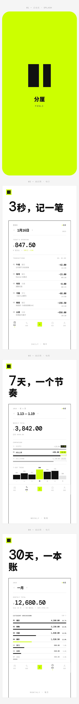

# 分厘 FenLi

<p align="center">
  
</p>

极简记账 HarmonyOS 应用 · 每一笔都清楚。

分厘是一款遵循极简设计语言的本地记账应用：黑白为主、荧光绿（#CCFF00）点缀、等宽字体数字。核心功能围绕“记一笔”展开，支持金额输入、分类选择、备注、日期和多账本，并在每日 / 每周 / 每月三个维度提供支出统计与趋势分析。

## 功能特性

- **记账输入**：数字键盘金额输入，支持小数、连续加减运算、备注和补记日期
- **交易管理**：新增、查看、删除交易，删除后即时刷新统计；金额以分为单位持久化，避免累计浮点误差
- **每日页**：当日支出合计、昨日对比和交易流水
- **每周页**：周支出合计、上周/两周前对比、7 日趋势柱状图和本周分析
- **每月页**：月度支出、月度日均、分类占比，包含医疗分类
- **账本与分类**：账本新增、重命名、删除与切换；分类新增、重命名、删除和已有交易迁移；默认账本与个人账本数据隔离
- **交易管理**：交易详情、编辑、删除和编辑失败回滚
- **预算设置**：月度预算档位、本地保存、预算使用、剩余预算和超支状态
- **记账提醒**：使用 HarmonyOS 后台代理提醒能力，受设备能力、通知开关和权限影响
- **数据导出**：生成兼容 Excel 打开的 UTF-8 CSV 文件
- **数据恢复**：使用 Preferences 保存业务快照，并接入系统备份扩展

## 工程结构

```
AppScope/              # 应用级配置（图标、名称）
entry/                 # 主模块
  src/main/ets/
    pages/Index.ets    # 主页面（Tabs：每日 / 每周 / 记账 / 每月 / 我的）
    model/              # 交易、账本、分类、预算和提醒数据模型
    service/            # Preferences 持久化、CSV 导出和后台提醒服务
    entrybackupability/ # 系统备份与恢复扩展
  src/main/resources/
    base/media/         # 启动图、导航图标和设置图标
    base/profile/       # 页面、路由和备份配置
hvigor/                # 构建工具链
build-profile.json5    # 构建配置
oh-package.json5       # 依赖管理
```

## 开发与构建

使用 DevEco Studio 打开工程，或使用 DevEco CLI 构建：

```bash
devecocli build
```

运行静态检查和 lint：

```bash
devecocli check lint entry/src/main/ets
```

项目当前使用 HarmonyOS SDK `6.1.0(23)`。构建产物位于 `entry/build/default/outputs/default/`。

## 数据与权限

业务数据保存在应用 Preferences 中，包含账本、分类、交易、预算和提醒设置。写入后会调用 `flush()`；清除应用数据或卸载应用会删除本地记录。

提醒功能需要 `ohos.permission.PUBLISH_AGENT_REMINDER`，并要求用户开启通知权限。系统能力或权限不可用时，页面会显示失败状态，不会伪造提醒已生效。

CSV 导出文件写入应用沙箱目录，导出完成后页面显示生成路径。当前导出内容为 CSV，Excel 可以直接打开；应用尚未提供独立的云同步能力。

## 当前验证状态

- ArkTS strict-mode 静态检查：通过
- DevEco lint：无错误，有 7 条性能警告
- `devecocli build`：通过
- Pura 90 UI 验证：待设备重新出现在 hdc 后执行

当前构建仍声明 `phone` 和 `wearable` 设备类型，部分日期选择器和弹窗 API 在 wearable 上会产生兼容性警告；主要交互以手机设备为目标。

## 应用预览

<p align="center">
  
</p>

> 从上至下：启动页 · 每日页（3秒，记一笔）· 每周页（7天，一个节奏）· 每月页（30天，一本账）

## 设计稿

UI 设计稿见仓库外层 `设计稿.html`（含每日 / 每周 / 每月 / 记账 / 我的页面及各设置弹窗），品牌标识见 `产品标识.png`。
